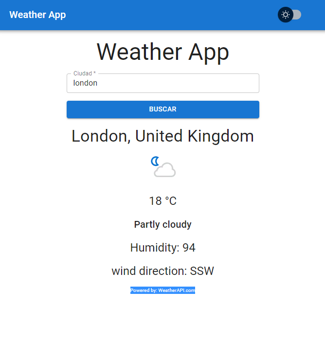
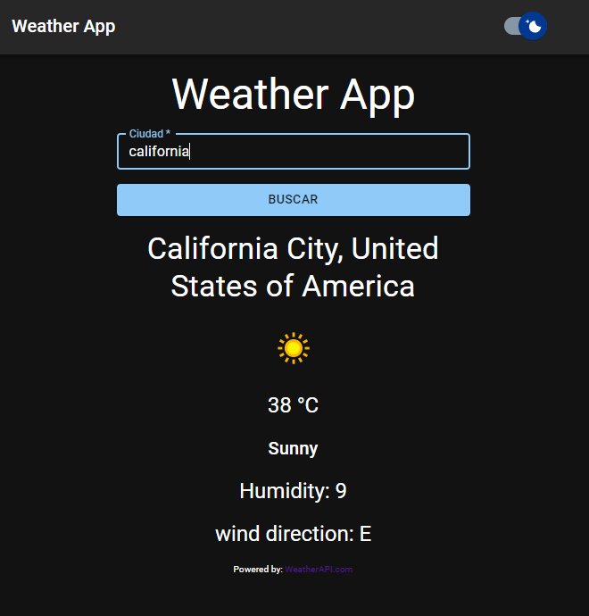

# WeatherApp-React

Aplicación de clima con React utilizando la API Powered by: **WeatherAPI.com**.

Se utilizó la biblioteca de **Material UI** para los componentes de interfaz de usuario en la aplicación.

La aplicación cuenta con dark mode como feature.

